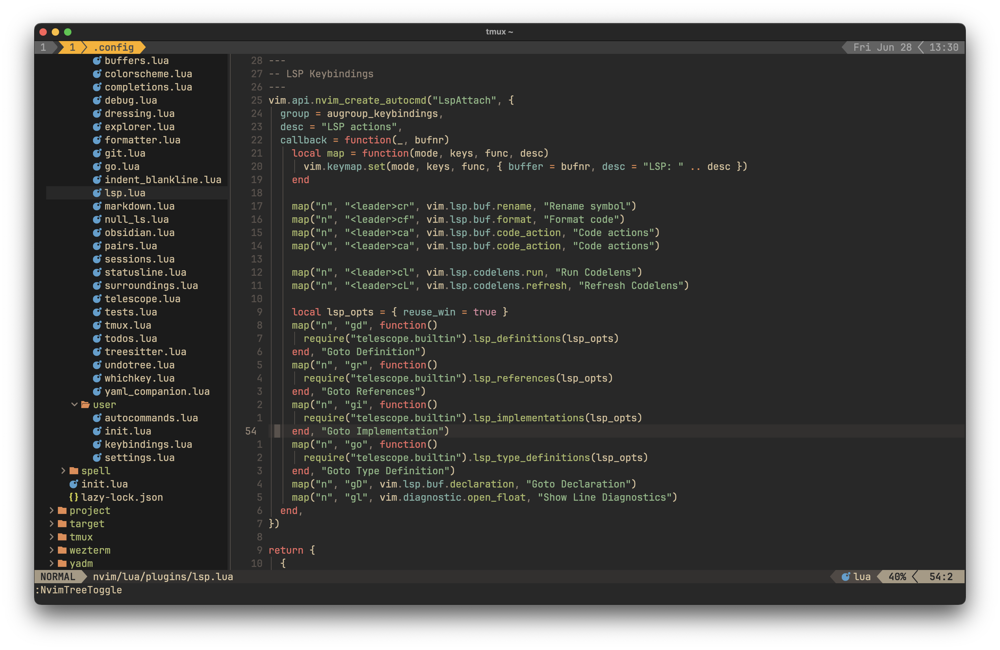

# Dotfiles

Dotfiles for Neovim, Wezterm, Git and other CLI tools I use.



Here's a quick set of commands you can run to get it ready on a fresh machine.

```
mkdir -p ~/.local/bin
curl -fLo ~/.local/bin/yadm https://github.com/TheLocehiliosan/yadm/raw/master/yadm
chmod a+x ~/.local/bin/yadm
~/.local/bin/yadm clone --bootstrap https://github.com/magnusvadoy/dotfiles.git
rm -rf ~/.local/bin/yadm
```
