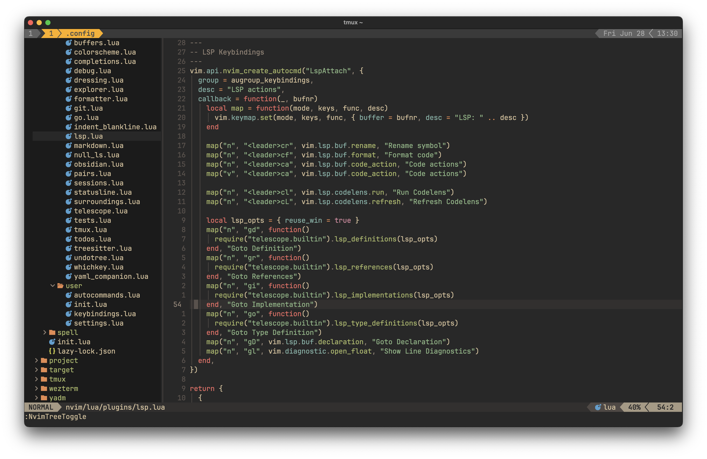

# Dotfiles

My dotfiles centered around Neovim, tmux, fish and other CLI tools I use. I use [yadm](https://github.com/yadm-dev/yadm) to manage them.



## Getting started

To get started on a fresh machine:

```
mkdir ~/bin
curl -fLo ~/bin/yadm https://github.com/TheLocehiliosan/yadm/raw/master/yadm
chmod a+x ~/bin/yadm
~/bin/yadm clone --bootstrap https://github.com/magnusvadoy/dotfiles.git
rm -rf ~/bin/yadm
```
